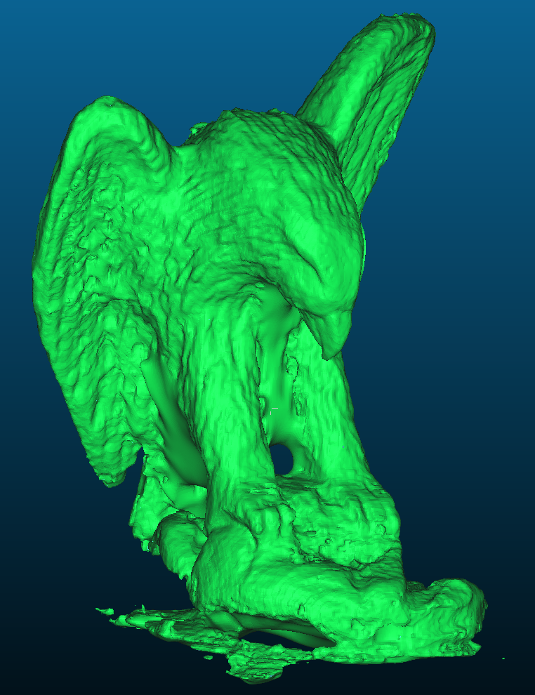
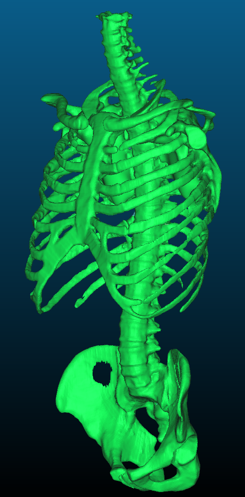

# CUDA Version of GPU Poisson Reconstruction

Reference: [Poisson Surface Reconstruction](https://hhoppe.com/poissonrecon.pdf) , [Data-Parallel Octrees for Surface Reconstruction](http://kunzhou.net/2010/ParallelOctree-preprint.pdf)

This algorithm reconstruct the surface by inputing the cloud point of the object.

Compared with V1 version of CPU implementation taking about 100s to process Bunny, this version takes 2.4s to process Bunny on RTX 2050 with maxDepth = 8 (depth number start from 0).

This implementation is my CUDA beginner project. If you find my implementation is not as efficient as the original paper's implementation, I beg your pardon.

## Example

### Eagle

### Torso

